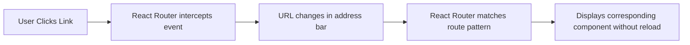

👉 **Routing — how React apps simulate multiple “pages” inside a single-page app (SPA)**

Below is your complete, **in-depth Markdown lesson** on **React Routing**, including:

- conceptual explanation
- real-world analogies
- examples with `react-router-dom`
- pitfalls, best practices, and mental models

---

````{"id":"31847","variant":"standard","title":"React Routing — Navigating the Single Page Universe"}
# 🧭 React Routing — Navigating the Single Page Universe

---

## 🚀 What Is Routing?

**Routing** in web development means **deciding what content to show when the URL changes.**

In traditional websites:
- Each link loads a new HTML page from the server.

In **React (SPA — Single Page Application)**:
- There’s only **one HTML file (`index.html`)**.
- React dynamically swaps components **based on the URL** — **without reloading the page**.

So instead of going to a new page, React **pretends to** by updating the view.

---

## 🌍 Real-World Analogy

Think of your app like a **theater stage 🎭**:
- The stage (root component) never changes.
- Different **scenes (routes)** are shown by changing the **backdrop and actors** — not by rebuilding the entire stage.

That’s what React Router does — it **changes the visible scene** without rebuilding the whole web app.

---

## 🧩 Why Do We Need Routing in React?

- To separate sections logically (`/home`, `/about`, `/contact`)
- To keep the app **fast** — no full-page reloads
- To let users **bookmark** or **share** links
- To handle **nested layouts** and **dynamic pages** (like `/user/123`)

---

## ⚙️ The Core Library — `react-router-dom`

Install it via npm or yarn:

```bash
npm install react-router-dom
```

Then you can use these main components:

| Component | Purpose |
|------------|----------|
| `<BrowserRouter>` | Wraps your app and enables routing features |
| `<Routes>` | A container for route definitions |
| `<Route>` | Maps a path to a component |
| `<Link>` | Navigates between routes without reloading |
| `useNavigate()` | Programmatic navigation |
| `useParams()` | Access dynamic route parameters |
| `useLocation()` | Read the current URL and query info |

---

## 🧠 Basic Example — Multi-Page Feel in One App

```jsx
import { BrowserRouter, Routes, Route, Link } from "react-router-dom";

function App() {
  return (
    <BrowserRouter>
      <nav>
        <Link to="/">🏠 Home</Link> | <Link to="/about">ℹ️ About</Link> | <Link to="/contact">📞 Contact</Link>
      </nav>

      <Routes>
        <Route path="/" element={<Home />} />
        <Route path="/about" element={<About />} />
        <Route path="/contact" element={<Contact />} />
      </Routes>
    </BrowserRouter>
  );
}

function Home() { return <h2>Welcome to Home Page</h2>; }
function About() { return <h2>About Our App</h2>; }
function Contact() { return <h2>Contact Us Here</h2>; }
```

🧩 **What happens:**
- Clicking `<Link>` updates the URL **without reload**
- React swaps components based on `path`
- The user feels like navigating different pages

---

## 🧮 Key Concepts and Flow



This is how React fakes multi-page navigation — **client-side routing**.

---

## ⚡ Dynamic Routing — URLs with Parameters

Example: `/user/:id`

```jsx
import { useParams } from "react-router-dom";

function UserProfile() {
  const { id } = useParams();
  return <h2>Showing Profile for User ID: {id}</h2>;
}
```

Define the route:

```jsx
<Route path="/user/:id" element={<UserProfile />} />
```

Now:
- `/user/101` → shows "User ID: 101"
- `/user/500` → shows "User ID: 500"

📦 Used for **product pages**, **user profiles**, etc.

---

## 🧩 Nested Routes — Reusable Layouts

Let’s say every dashboard page has a sidebar.

```jsx
<Route path="/dashboard" element={<DashboardLayout />}>
  <Route path="home" element={<DashboardHome />} />
  <Route path="settings" element={<DashboardSettings />} />
</Route>
```

In `DashboardLayout`:

```jsx
import { Outlet, Link } from "react-router-dom";

function DashboardLayout() {
  return (
    <div className="dashboard">
      <nav>
        <Link to="home">Home</Link> | <Link to="settings">Settings</Link>
      </nav>
      <main>
        <Outlet /> {/* Where nested routes render */}
      </main>
    </div>
  );
}
```

🧠 Analogy:
Like a **house** with multiple rooms.
The **walls (layout)** stay, but the **inside (Outlet)** changes depending on which “room” (route) you enter.

---

## 🔄 Programmatic Navigation

Sometimes you navigate **via code**, not clicks.

```jsx
import { useNavigate } from "react-router-dom";

function Login() {
  const navigate = useNavigate();
  function handleLogin() {
    // after login success
    navigate("/dashboard");
  }
  return <button onClick={handleLogin}>Login</button>;
}
```

🧭 Analogy: It’s like a GPS system changing route programmatically instead of waiting for the driver to choose a turn.

---

## 💬 Reading Route Information

### 1️⃣ useLocation()

```jsx
import { useLocation } from "react-router-dom";

function DebugLocation() {
  const location = useLocation();
  return <pre>{JSON.stringify(location, null, 2)}</pre>;
}
```

Shows path, search params, hash, etc.

### 2️⃣ Query Parameters

```jsx
import { useSearchParams } from "react-router-dom";

function Search() {
  const [params] = useSearchParams();
  const q = params.get("q");
  return <h2>Results for: {q}</h2>;
}
```

---

## 🧩 Protected Routes (Authentication Example)

You can prevent access to certain pages if not logged in:

```jsx
function PrivateRoute({ children }) {
  const isAuth = localStorage.getItem("auth");
  return isAuth ? children : <Navigate to="/login" />;
}

<Route path="/dashboard" element={<PrivateRoute><Dashboard /></PrivateRoute>} />
```

🔐 **Real-world analogy:**
Security guard at a club entrance — checks if you’re allowed inside before letting you through.

---

## ⚠️ Common Pitfalls

| Pitfall | Explanation | Fix |
|----------|--------------|-----|
| Using `<a href>` instead of `<Link>` | Causes full page reload | Always use `<Link>` |
| Forgetting `<BrowserRouter>` | Routes won’t work | Wrap your app inside `<BrowserRouter>` |
| Incorrect nested paths | Nested routes need relative paths | Use `<Outlet>` properly |
| Infinite redirect loop | Redirects without auth check | Ensure conditions before navigate |

---

## 🧠 Advanced Routing Features

| Feature | Description |
|----------|-------------|
| **HashRouter** | Uses `#` in URLs (useful for static hosting) |
| **MemoryRouter** | Keeps history in memory (for tests or embedded apps) |
| **Lazy Loading Routes** | Load routes only when visited (performance) |
| **404 Fallbacks** | Use a wildcard route `path="*"` for “Not Found” pages |
| **Transition & Animations** | Combine with `react-transition-group` for route animations |

---

## 💡 Example — 404 Fallback Route

```jsx
<Route path="*" element={<h2>404 — Page Not Found</h2>} />
```

Always define at the end of your `<Routes>`.

---

## 🧭 Real-World Analogy Recap

| Real World | React Router Equivalent |
|-------------|--------------------------|
| **City map** | The full app |
| **Road signs** | `<Link>` components |
| **Road network** | Defined routes |
| **GPS redirect** | `useNavigate()` |
| **Checkpoint security** | ProtectedRoute |

React Router = **the traffic controller** of your app 🚦

---

## 💬 Interview-style Q&A

| Question | Ideal Answer |
|-----------|---------------|
| What is client-side routing? | Navigating between views without full page reloads, handled by React Router. |
| Difference between `<a>` and `<Link>`? | `<Link>` prevents reload; `<a>` reloads the entire page. |
| How to pass dynamic parameters? | Use `:param` syntax and `useParams()` hook. |
| How do nested routes work? | Define child `<Route>` inside parent and render `<Outlet>` in layout. |
| What is programmatic navigation? | Using `useNavigate()` to change routes via code. |

---

## ✅ Best Practices

- Wrap your app in `<BrowserRouter>` once (usually in `index.js`).
- Use `<Link>` for navigation — never `<a>`.
- Keep routes organized in a central file.
- Use **lazy loading** for large apps.
- Always handle a 404 fallback route.
- Protect sensitive routes with auth checks.

---

## 🧩 TL;DR Summary

| Concept | Description |
|----------|--------------|
| **Routing** | Navigation between views inside SPA |
| **react-router-dom** | Library that manages routing |
| **BrowserRouter** | Enables routing features |
| **Routes / Route** | Define navigation paths |
| **useNavigate** | Navigate programmatically |
| **useParams** | Access dynamic parts of the URL |
| **useLocation** | Get URL details |
| **ProtectedRoute** | Control access based on conditions |

---

## 🎭 Analogy — The Single Page Universe

Imagine your React app as a **universe** 🌌.
Each “page” is a **planet** 🪐, and React Router is the **spacecraft navigation system** 🚀.
When you move between planets, you **don’t rebuild the universe** —
You simply **change coordinates** and React instantly shows the new world.

That’s the power of **React Routing**.

---
````
